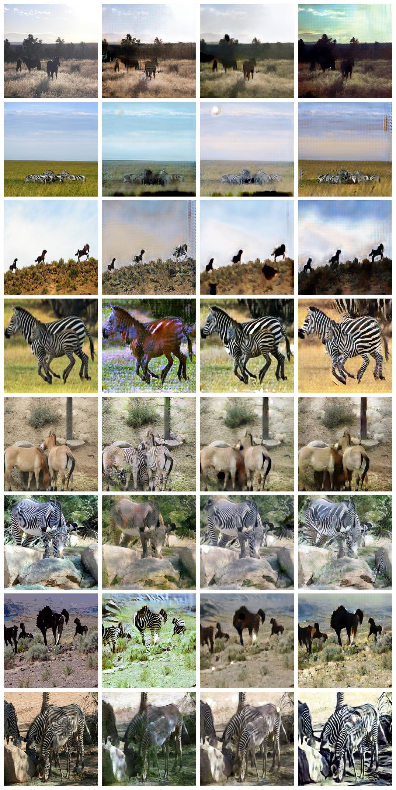
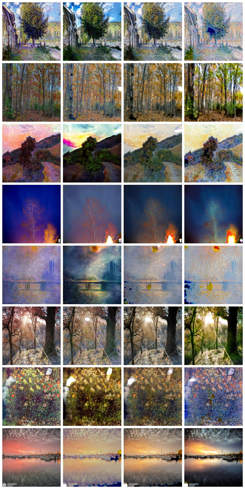
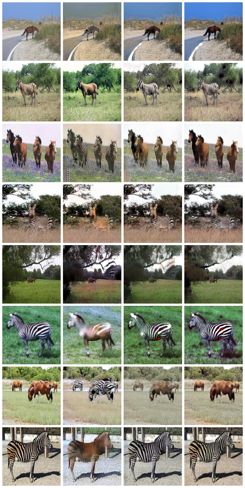
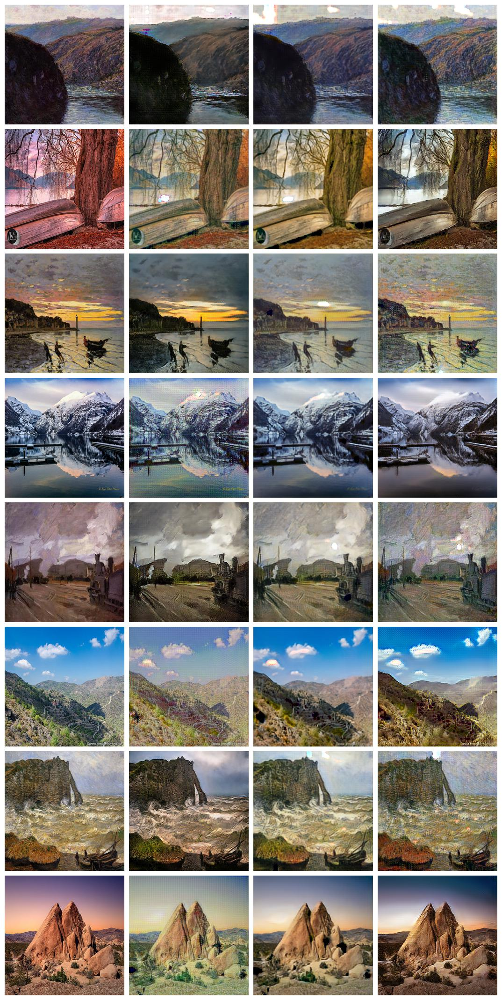
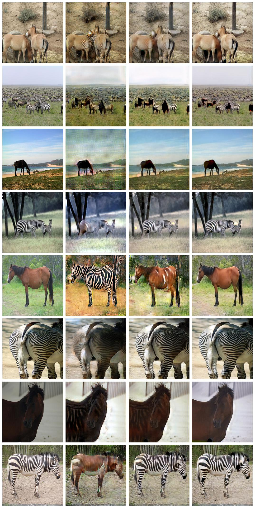

# Cycle GAN
[](https://www.tensorflow.org/)
[](https://github.com/asahi417/WassersteinGAN/blob/master/LICENSE)

Tensorflow implementation of [Cycle GAN](https://arxiv.org/pdf/1703.10593.pdf).
- Dataset are converted to TFRecord format
- Tensorboard visualization (metrics, output generated image)

## Get started
Clone repository
```
git clone https://github.com/asahi417/CycleGAN
cd CycleGAN
pip install .
```

### setup dataset 

```bash
mkdir datasets
bash bin/download_cyclegan_dataset.sh monet2photo
```
You can choose dataset from following list: monet2photo, horse2zebra, vangogh2photo, ukiyoe2photo, cezanne2photo

### convert dataset to TFRecord format

```bash
python bin/build_tfrecord.py --data monet2photo 
```

### train cycle GAN

```bash
python bin/train.py --data monet2photo -e 200
```

You can tune hyperparameter by modifying [this file](./bin/hyperparameter.toml).

### visualize by tensorboard

```bash
tensorboard logdir=./checkpoint --port 555
```

## Result
Here, some generated examples are shown with different identity map regularizer (lambda_id in the paper).
### with 0.0 identity regularizer
<p align="center">
  
  <br><i>Fig 1: Horse <-> zebra ([Original, Generated, Cycled, Identity]) </i>
</p>

<p align="center">
  
  <br><i>Fig 2: Monet <-> photo ([Original, Generated, Cycled, Identity]) </i>
</p>

### with 0.1 identity regularizer
<p align="center">
  
  <br><i>Fig 3: Horse <-> zebra ([Original, Generated, Cycled, Identity]) </i>
</p>

<p align="center">
  
  <br><i>Fig 4: Monet <-> photo ([Original, Generated, Cycled, Identity]) </i>
</p>

### with 0.5 identity regularizer
<p align="center">
  
  <br><i>Fig 5: Horse <-> zebra ([Original, Generated, Cycled, Identity]) </i>
</p>

